# 🎨 Genesis Frontend

**Agentes especializados en generación de código frontend para el ecosistema Genesis Engine**

Genesis Frontend es el módulo especializado en generación de aplicaciones frontend usando agentes de IA. Forma parte del ecosistema Genesis Engine y se enfoca exclusivamente en la creación de código frontend moderno y optimizado.

[](https://python.org)
[](https://github.com/genesis-engine/genesis-engine)
[](LICENSE)

## 🧠 Rol en el Ecosistema

```mermaid
graph TD
    A[genesis-core] -->|coordina| B[genesis-frontend]
    B -->|usa| C[MCPturbo]
    B -->|colabora con| D[genesis-templates]
    B -->|genera| E[Código Frontend]
    
    F[NextJSAgent] -->|especialista| G[Next.js Apps]
    H[ReactAgent] -->|especialista| I[React SPAs]
    J[VueAgent] -->|especialista| K[Vue.js Apps]
    L[UIAgent] -->|especialista| M[Design Systems]
```



### ✅ Responsabilidades

- **Generación Frontend**: Crear aplicaciones completas de Next.js, React, Vue.js
- **Componentes UI**: Generar componentes reutilizables y sistemas de diseño
- **Configuración**: Setup automático de TypeScript, Tailwind, testing, etc.
- **Integración LLM**: Usar IA para generar código inteligente y optimizado

### ❌ Limitaciones (Siguiendo la Doctrina)

- **No coordina workflows**: Solo ejecuta cuando genesis-core le solicita
- **No interactúa con usuarios**: No tiene CLI ni interfaz propia
- **No conoce backend**: Se enfoca exclusivamente en frontend
- **No maneja DevOps**: Solo genera código, no despliega

## 🤖 Agentes Disponibles

### NextJSAgent
**Especialista en aplicaciones Next.js**

```python
from genesis_frontend import NextJSAgent

agent = NextJSAgent()
await agent.initialize()

# Generar aplicación Next.js completa
result = await agent.execute_task({
    "name": "generate_nextjs_app",
    "params": {
        "output_path": "./my-nextjs-app",
        "framework": "nextjs",
        "typescript": True,
        "app_router": True,
        "tailwind_css": True,
        "schema": {
            "project_name": "My Next App",
            "description": "Modern Next.js application"
        }
    }
})
```

**Capacidades:**
- App Router y Pages Router
- Server Components
- TypeScript setup
- Tailwind CSS integration
- API Routes generation
- Middleware configuration

### ReactAgent
**Especialista en aplicaciones React SPA**

```python
from genesis_frontend import ReactAgent

agent = ReactAgent()
await agent.initialize()

# Generar aplicación React con Vite
result = await agent.execute_task({
    "name": "generate_react_app", 
    "params": {
        "output_path": "./my-react-app",
        "framework": "react",
        "build_tool": "vite",
        "state_management": "redux_toolkit",
        "typescript": True,
        "tailwind_css": True
    }
})
```

**Capacidades:**
- Vite/Webpack configuration
- Redux Toolkit / Zustand setup
- React Router configuration
- Component generation
- Hook generation
- Testing setup (Vitest/Jest)

### VueAgent
**Especialista en aplicaciones Vue.js**

```python
from genesis_frontend import VueAgent

agent = VueAgent()
await agent.initialize()

# Generar aplicación Vue 3
result = await agent.execute_task({
    "name": "generate_vue_app",
    "params": {
        "output_path": "./my-vue-app",
        "framework": "vue",
        "vue_version": "3",
        "composition_api": True,
        "state_management": "pinia",
        "ui_library": "vuetify"
    }
})
```

**Capacidades:**
- Vue 3 Composition API
- Pinia/Vuex setup
- Vue Router configuration
- Vuetify/Quasar integration
- Composables generation
- PWA configuration

### UIAgent
**Especialista en diseño de interfaz**

```python
from genesis_frontend import UIAgent

agent = UIAgent()
await agent.initialize()

# Crear sistema de diseño completo
result = await agent.execute_task({
    "name": "create_design_system",
    "params": {
        "output_path": "./design-system",
        "design_system": "custom",
        "color_palette": "blue_theme", 
        "dark_mode": True,
        "accessibility": True
    }
})
```

**Capacidades:**
- Design tokens generation
- Color palette creation
- Component library creation
- Typography system
- Dark mode implementation
- Accessibility optimization

## ⚡ Uso Rápido

### Instalación

```bash
pip install genesis-frontend
```

### Validar Entorno

```python
from genesis_frontend import validate_environment

env_status = validate_environment()
print(env_status)
# {
#   "valid": True,
#   "checks": {
#     "node": {"valid": True, "version": "v18.17.0"},
#     "package_manager": {"available": True, "manager": "npm"}
#   }
# }
```

### Inicio Rápido

```python
from genesis_frontend import quick_start

# Generar proyecto Next.js
result = quick_start(
    framework="nextjs",
    project_name="my-awesome-app",
    output_path="./projects/",
    typescript=True,
    tailwind_css=True,
    app_router=True
)

print(result)
# {
#   "success": True,
#   "framework": "nextjs", 
#   "project_name": "my-awesome-app",
#   "agent_used": "nextjs_agent"
# }
```

### Crear Solo Estructura

```python
from genesis_frontend import create_project_structure

# Crear directorios sin generar código
directories = create_project_structure("react", "./my-react-app")
print(directories)
# ['./my-react-app/src', './my-react-app/public', ...]
```

## 🔧 Configuración

### Frameworks Soportados

```python
from genesis_frontend import get_supported_frameworks

frameworks = get_supported_frameworks()
print(frameworks)
# ['nextjs', 'next', 'react', 'vue', 'vue3', 'design', 'ui', 'components']
```

### Información de Framework

```python
from genesis_frontend import get_framework_info

info = get_framework_info("nextjs")
print(info)
# {
#   "framework": "nextjs",
#   "agent_id": "nextjs_agent", 
#   "capabilities": ["nextjs_generation", "app_router_setup", ...],
#   "defaults": {"typescript": True, "app_router": True, ...}
# }
```

### Configuración por Defecto

```python
from genesis_frontend import config

# Obtener defaults para React
defaults = config.get_framework_defaults("react")
print(defaults)
# {
#   "typescript": True,
#   "build_tool": "vite",
#   "state_management": "redux_toolkit",
#   "ui_library": "tailwindcss"
# }
```

## 🛠️ Integración con MCPturbo

Genesis Frontend está diseñado para trabajar con MCPturbo para comunicación entre agentes:

```python
import asyncio
from mcpturbo import MCPProtocol
from genesis_frontend import NextJSAgent

async def main():
    # Configurar protocolo MCP
    protocol = MCPProtocol()
    
    # Crear y registrar agente
    agent = NextJSAgent()
    await agent.initialize()
    agent.mcp_protocol = protocol
    
    # El agente ahora puede comunicarse via MCP
    # con otros agentes del ecosistema Genesis
    
asyncio.run(main())
```

## 📁 Estructura de Proyecto Generado

### Next.js App Router

```
my-nextjs-app/
├── app/
│   ├── layout.tsx       # Layout principal
│   ├── page.tsx         # Página principal
│   └── globals.css      # Estilos globales
├── components/
│   ├── ui/              # Componentes UI
│   └── layout/          # Componentes layout
├── lib/                 # Utilidades
├── hooks/               # Custom hooks
├── types/               # Tipos TypeScript
├── public/              # Assets estáticos
├── package.json         # Dependencias
├── next.config.js       # Configuración Next.js
├── tailwind.config.js   # Configuración Tailwind
├── tsconfig.json        # Configuración TypeScript
└── Dockerfile           # Contenedor Docker
```

### React SPA

```
my-react-app/
├── src/
│   ├── components/      # Componentes React
│   ├── hooks/           # Custom hooks
│   ├── store/           # Redux/Zustand store
│   ├── utils/           # Utilidades
│   ├── types/           # Tipos TypeScript
│   ├── App.tsx          # Componente principal
│   ├── main.tsx         # Punto de entrada
│   └── index.css        # Estilos globales
├── public/              # Assets estáticos
├── index.html           # HTML principal
├── package.json         # Dependencias
├── vite.config.ts       # Configuración Vite
├── tailwind.config.js   # Configuración Tailwind
└── tsconfig.json        # Configuración TypeScript
```

## 🎯 Casos de Uso Específicos

### Generar Componente Individual

```python
from genesis_frontend import create_agent

agent = create_agent("react")

# Generar componente específico
result = await agent.execute_task({
    "name": "generate_component",
    "params": {
        "component_name": "UserCard",
        "component_type": "functional",
        "props": ["user", "onEdit", "onDelete"],
        "styling": "tailwind"
    }
})
```

### Configurar Estado Global

```python
agent = create_agent("react")

# Setup Redux Toolkit
result = await agent.execute_task({
    "name": "setup_state_management",
    "params": {
        "state_library": "redux_toolkit",
        "slices": ["user", "posts", "ui"],
        "api_integration": True
    }
})
```

### Crear Sistema de Diseño

```python
agent = create_agent("ui")

# Generar design system completo
result = await agent.execute_task({
    "name": "create_design_system",
    "params": {
        "color_palette": "blue_theme",
        "components": ["Button", "Input", "Card", "Modal"],
        "dark_mode": True,
        "design_tokens": True
    }
})
```

## 🔍 Validación y Errores

### Validación de Nombres

```python
from genesis_frontend import validate_project_name

errors = validate_project_name("my-app")
if errors:
    print(f"Errores: {errors}")
else:
    print("Nombre válido")
```

### Validación de Configuración

```python
from genesis_frontend import validate_framework_config

errors = validate_framework_config("react", {
    "build_tool": "vite",
    "state_management": "redux_toolkit",
    "typescript": True
})

if errors:
    print(f"Configuración inválida: {errors}")
```

### Manejo de Excepciones

```python
from genesis_frontend import (
    FrontendValidationError,
    FrameworkNotSupportedError,
    create_agent
)

try:
    agent = create_agent("unsupported-framework")
except FrameworkNotSupportedError as e:
    print(f"Framework no soportado: {e}")
    print(f"Frameworks disponibles: {e.supported_frameworks}")

try:
    # Configuración inválida
    pass
except FrontendValidationError as e:
    print(f"Errores de validación: {e.validation_errors}")
```

## 🧪 Testing

```bash
# Ejecutar tests
pytest tests/

# Con cobertura
pytest --cov=genesis_frontend tests/

# Tests específicos
pytest tests/test_agents.py -v
```

## 📚 Documentación Adicional

- [Arquitectura del Ecosistema](docs/architecture.md)
- [Guía de Agentes](docs/agents.md)
- [Configuración Avanzada](docs/configuration.md)
- [Integración MCPturbo](docs/mcp-integration.md)
- [Ejemplos Completos](examples/)

## 🤝 Contribuir

```bash
# Desarrollo local
git clone https://github.com/genesis-engine/genesis-frontend.git
cd genesis-frontend

# Instalar dependencias
pip install -e ".[dev]"

# Ejecutar tests
pytest

# Verificar código
black .
isort .
mypy .
```

## 📄 Licencia

MIT License - ver [LICENSE](LICENSE) para detalles.

## 🔗 Ecosistema Genesis

- **[genesis-core](https://github.com/genesis-engine/genesis-core)**: Orquestador central
- **[genesis-agents](https://github.com/genesis-engine/genesis-agents)**: Registro de agentes
- **[genesis-templates](https://github.com/genesis-engine/genesis-templates)**: Motor de templates
- **[mcpturbo](https://github.com/genesis-engine/mcpturbo)**: Protocolo de comunicación

---

**Generado por el equipo de Genesis Engine** 🚀